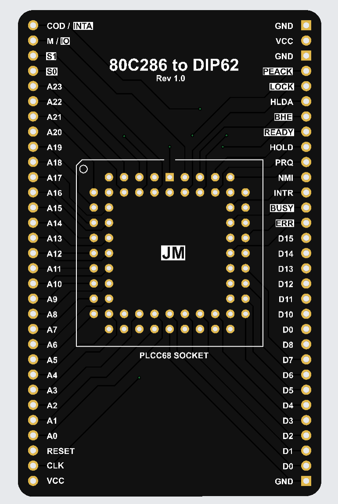

# 80286 PLCC68 TO DIP62 CONVERTER BOARD
This is a simple two-layer PCB design that converts the 80286 CPU in the PLCC68 package to DIP62 package.

### To use it:
- Download the provided gerber files.
- Go to [JLCPCB](https://jlcpcb.com/), [PCBWAY](https://www.pcbway.com/) or any other manufacturer.
- Upload the *gerber* files. The board dimensions, via size and other characteristic should be filled in automatically.
- Place the order and wait for it to arrive.
- Buy the [ PLCC68 socket](https://eu.mouser.com/ProductDetail/3M-Electronic-Solutions-Division/8468-11B1-RK-TP?qs=WZRMhwwaLl%2F69ihuzHn6sA%3D%3D).
- After you have the PCB and the socket, solder the socket on to the PCB while making sure the notch on the PCB matches the notch on the socket.
- Enjoy :DDDD !

## Some important details
- There are only **62** pins going out of the board, this is because there are 6 NC pins on the CPU itself.
- The PCB is designed so that all of the addresing and data pins are next to eachother, for convenience. 
- There are 2 VCC pins and 3 GND pins, all of them need to be connected to +5V/GND and **not left floating**.
- The pins that are active-high are labeled using normal text, while active-low pins are in negative text.
- For more details on the 80286 CPU check out the [datasheet](https://datasheets.chipdb.org/Harris/80c286.pdf)
- The *80286.kicad_pro* file can be opened using KiCads free software and edited if needed.
## A picture of the PCB from JLCPCB's PCB viewer:

